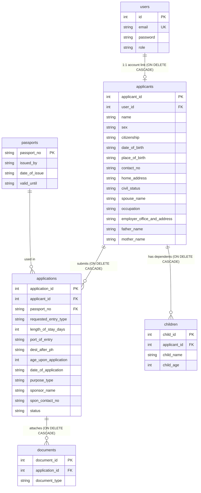

# VisaAppPortal

[](https://adoptium.net/)
[](https://gradle.org)
[](https://maven.apache.org)
[](https://www.sqlite.org/)

An industry-standard Visa Application Portal showcasing **database foundational skills integrating CRUD operations**, Third Normal Form (3NF) relational design, and core **Object-Oriented Programming (OOP)** principles using **Java** and **SQLite**.

---

## 🏛️ Architecture Overview

The codebase is organized following standard multi-tier architectural practices:

```
VisaAppPortal/
├── build.gradle                     # Gradle build configuration
├── settings.gradle                  # Gradle project settings
├── gradlew / gradlew.bat            # Gradle wrapper scripts
├── pom.xml                          # Maven build configuration
├── run.ps1                          # Flexible PowerShell run script
├── lib/
│   └── sqlite-jdbc.jar              # SQLite JDBC driver
├── db/
│   ├── schema.sql                   # Canonical 3NF DDL schema & indexes
│   └── migrate_db.py                # Database migration reference script
│
└── src/
    ├── main/java/com/visa/app/
    │   ├── Main.java                # Application bootstrap entry point
    │   ├── DatabaseManager.java     # Facade adapter for legacy UI compatibility
    │   │
    │   ├── model/                   # Domain Entities, Enums & ViewModels
    │   │   ├── Person.java          # Abstract base (Abstraction, Polymorphism)
    │   │   ├── Applicant.java       # Primary applicant profile (Builder Pattern)
    │   │   ├── Application.java     # Visa travel record
    │   │   ├── ApplicationStatus.java # Status enum (PENDING, APPROVED, DENIED)
    │   │   ├── ApplicationSummaryDTO.java # Typed DTO for dashboard table views
    │   │   ├── Child.java           # Dependent child (extends Person)
    │   │   ├── Document.java        # Supporting document record
    │   │   ├── DocumentType.java    # Document type enum
    │   │   ├── Passport.java        # National passport record
    │   │   ├── User.java            # Auth credentials & role
    │   │   └── VisaApplication.java # Composite Form ViewModel for UI wizards
    │   │
    │   ├── dao/                     # Data Access Objects (CRUD & SQL Queries)
    │   │   ├── DatabaseConnection.java # Centralized connection manager (FKs ON)
    │   │   ├── UserDAO.java         # Authentication & user management
    │   │   ├── ApplicantDAO.java    # Applicant CRUD (Q1, Q2, Q3)
    │   │   ├── ApplicationDAO.java  # Application CRUD & search (Q4, Q5, Q6)
    │   │   ├── PassportDAO.java     # Passport management
    │   │   ├── DocumentDAO.java     # Supporting docs & complex reports (Q7 - Q11)
    │   │   └── ChildDAO.java        # Child dependent management
    │   │
    │   ├── service/
    │   │   └── VisaService.java     # Unified business service & transactions
    │   │
    │   ├── util/
    │   │   └── NameUtils.java       # Reusable string & name parsing utilities
    │   │
    │   └── utils/
    │       └── BackendBridge.java   # Facade for backward-compatibility
    │
    └── test/java/com/visa/app/
        └── VisaServiceTest.java     # Integration test suite for all CRUD & Q1-Q11
```

---

## 📊 Database Schema (3NF)

The database schema is normalized to **Third Normal Form (3NF)** with referential integrity and cascading deletes enforced (`PRAGMA foreign_keys = ON;`).



---

## 🔍 SQL Queries Implementation Matrix

| Query | Complexity | Classification | Implemented In | Description |
|:---|:---|:---|:---|:---|
| **Q1** | Simple | `INSERT` | `ApplicantDAO.insertApplicant` | Transactional insert into `users` and `applicants` |
| **Q2** | Simple | `SELECT *` | `ApplicantDAO.getAllApplicants` | Select all registered applicants |
| **Q3** | Moderate | `INNER JOIN + WHERE` | `ApplicantDAO.getApplicantProfile` | Fetches applicant profile joined with user email |
| **Q4** | Simple | `UPDATE` | `ApplicationDAO.updateApplicationStatus` | Updates status (`APPROVED` or `DENIED`) |
| **Q5** | Moderate | `WHERE + LIKE` | `ApplicationDAO.searchApplications` | Keyword search on name and citizenship |
| **Q6** | Moderate | `JOIN + GROUP BY + COUNT` | `ApplicationDAO.getApplicationsWithDocumentCount`| Applications with total count of attached documents |
| **Q7** | Simple | `INSERT` | `DocumentDAO.insertDocument` | Attaches a supporting travel document |
| **Q8** | Moderate | `SELECT with WHERE` | `DocumentDAO.getDocumentsByApplicationId` | Retrieves all documents for an application |
| **Q9** | Difficult | `3-Table INNER JOIN` | `DocumentDAO.getApplicantsWithPassportDetails` | Joins `users` ⟶ `applicants` ⟶ `applications` ⟶ `passports` |
| **Q10** | Difficult | `Subquery + HAVING` | `DocumentDAO.getCompleteApplications` | Finds applications with all 3 supporting document types |
| **Q11** | Difficult | `Correlated Subquery + Date Math` | `DocumentDAO.getApplicationsWithExpiringPassports` | Identifies passports expiring within 180 days using SQLite `julianday()` |

---

## 💡 Object-Oriented Principles Showcase

- **Abstraction**: `Person` abstract base class defining common biographic attributes and abstract method `getProfileSummary()`.
- **Inheritance**: `Applicant` and `Child` extend `Person`, inheriting core attributes and identity methods.
- **Polymorphism**: `getProfileSummary()` dynamically formats role-specific descriptions at runtime (`Primary Applicant: ...` vs `Dependent Child: ...`).
- **Encapsulation**: All entity state is private with type-safe accessors, validation, and enums (`ApplicationStatus`, `DocumentType`).
- **Composition**: `Application` composes `Applicant`, `Passport`, `List<Child>`, and `List<Document>`.
- **Builder Pattern**: `Applicant.builder()` allows clean, maintainable object construction without telescoping constructors.

---

## 🚀 Building & Running

### Prerequisites
- **JDK 17 or higher** (JDK 17, 21, 25 tested and supported)

### Using Gradle Wrapper (Recommended)
```powershell
# Run the application
.\gradlew.bat run

# Run automated tests
.\gradlew.bat test
```

### Using Apache Maven
```powershell
# Run the application
mvn compile exec:java

# Run automated tests
mvn test
```

### Using PowerShell Script
```powershell
# Default (Gradle Wrapper)
.\run.ps1

# Launch via Maven
.\run.ps1 -Maven

# Compile and launch directly with javac
.\run.ps1 -Direct
```

---

## 🧪 Default Test Accounts

| Role | Email | Password |
|---|---|---|
| **Administrator** | `admin@visa.com` | `admin123` |
| **Applicant** | `user@visa.com` | `user123` |
